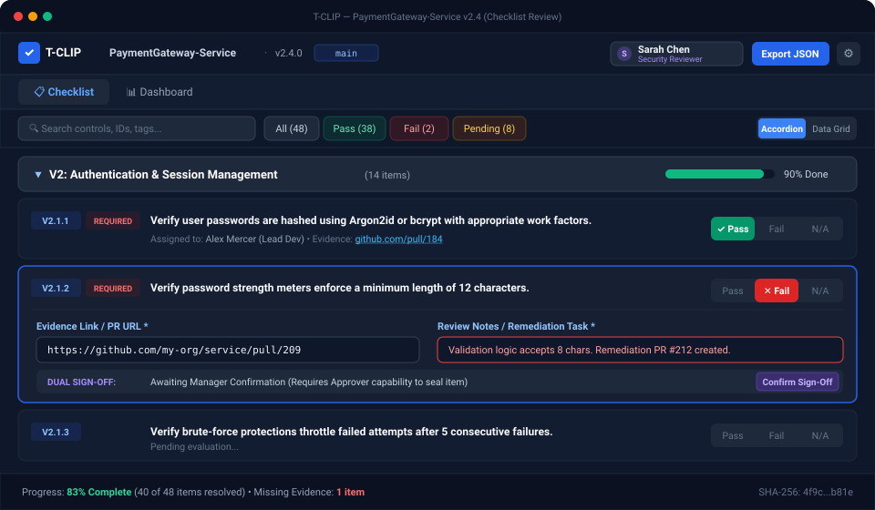
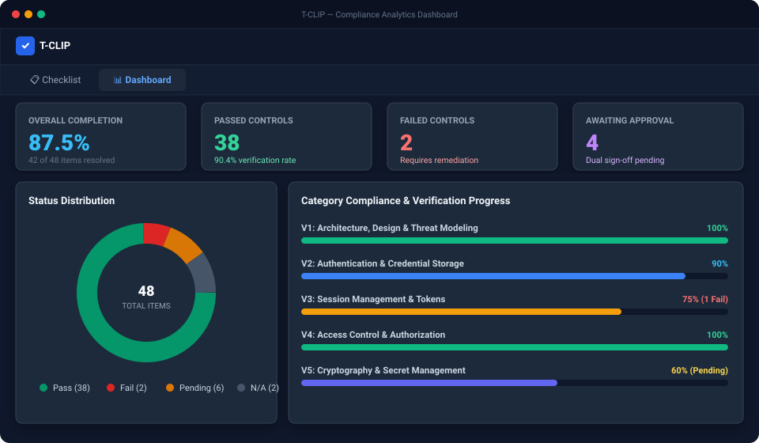
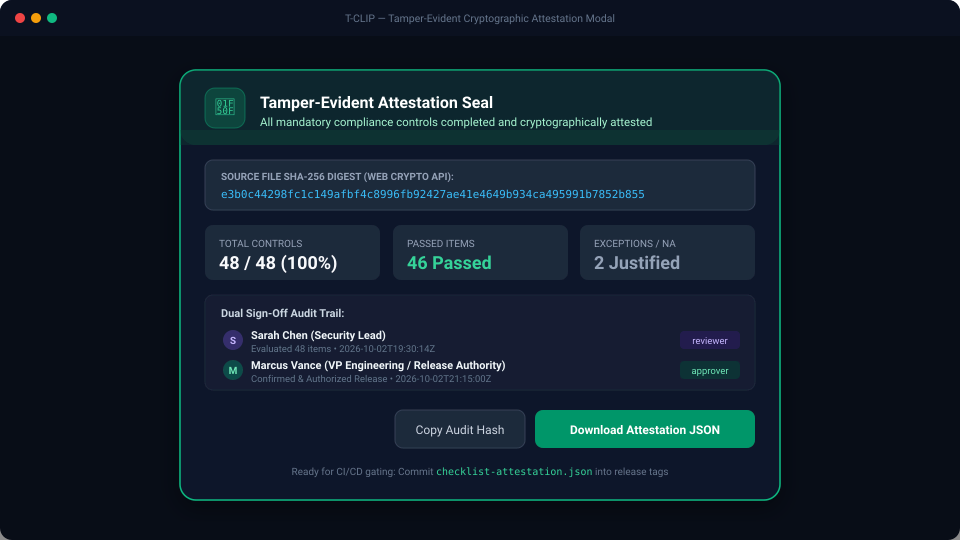
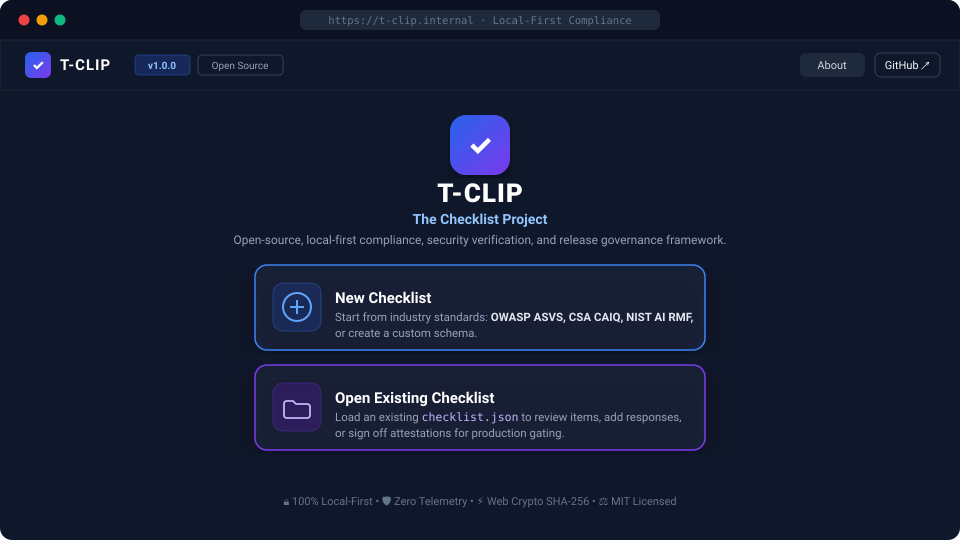

# T-CLIP — Practical User Guide

<div align="center">

**The Checklist Project — Pre-Release Verification Made Simple**  
*A clean, local-first checklist tool that helps teams verify security, quality, and release readiness before shipping code.*

[](LICENSE)
[](#zero-setup--100-private)
[](#how-your-team-uses-it-day-to-day)

[What & Why](#what-is-t-clip) • [Daily Routine](#how-your-team-uses-it-day-to-day) • [Roles](#who-does-what-simple-roles) • [GitHub & PR Workflow](#how-to-effectively-use-t-clip-with-github) • [Screenshots](#interface-tour--screenshots) • [FAQ](#frequently-asked-questions)

</div>

---

## What is T-CLIP?

Think of **T-CLIP** as an **interactive pre-flight checklist** for your software releases.

Before merging a major Pull Request or shipping a new version to production, T-CLIP gives your team an easy, visual way to verify that critical checks—like authentication, data encryption, error logging, and API guardrails—have actually been completed and verified.

### Zero Setup & 100% Private
- **Runs entirely in your web browser:** No servers to install, no cloud databases to configure, and zero user accounts to manage.
- **Zero Telemetry:** Your code, vulnerability details, and review notes never leave your computer.
- **Compliance as Code:** Your entire checklist lives in a single human-readable file (`checklist.json`) right inside your Git repository alongside your code.

---

## Why Use T-CLIP Instead of a Spreadsheet?

Most engineering teams track release readiness using Google Sheets, Excel, or Confluence tables. Here is why that usually breaks down in practice:

| What Usually Happens in Spreadsheets | How T-CLIP Fixes It |
|:---|:---|
| **Accidental Overwrites:** Someone edits a cell, deletes a column, or breaks a formula. | **Schema Enforced:** Checklist questions and requirements cannot be accidentally corrupted. |
| **No Audit Trail:** You cannot tell who approved a check or when it happened. | **Clear History:** Every answer records the actor's name, role, and exact timestamp. |
| **Disconnected from Code:** Spreadsheets live in a cloud drive, out of sync with branches. | **Lives in Git:** `checklist.json` is committed with your code. Diffs show in PR reviews. |
| **Release Day Panic:** Everyone scrambles to fill out 100 rows the day before launch. | **Continuous Habit:** Developers attach PR links as they write features, one PR at a time. |
| **Lack of Accountability:** Implementers approve their own work without oversight. | **Dual Sign-Off:** Developers provide proof; security/tech leads evaluate and sign off. |

---

## How Your Team Uses It Day-to-Day

Here is the realistic, low-friction routine software teams follow:

```
[Day 1 Setup]          [During Sprint]              [PR Review]              [Release Day]
Tech Lead exports  ──► Developer attaches PR  ──►  Reviewer verifies &  ──►  Lead checks Dashboard &
checklist.json         link in checklist.json      marks "Pass" in PR         signs off release
```

### 1. Day One Setup (5 Minutes)
A Tech Lead or Architect opens T-CLIP, chooses an industry template (such as **OWASP ASVS** for web apps, **NIST AI** for generative AI, or creates custom questions), clicks **Export to Disk**, and commits `checklist.json` into the root of the repository:
```bash
git add checklist.json
git commit -m "chore: add T-CLIP release checklist"
```

### 2. Everyday Feature Work (Developer / Contributor)
When you build a feature that touches sensitive logic (like user login, payment processing, database queries, or AI prompts):
1. Open T-CLIP in your browser and load `checklist.json`.
2. Find the relevant check (e.g. *"Password hashing"*).
3. Paste your GitHub PR link in the **Evidence URL** box and add a brief note (e.g. *"Using Argon2id with 64MB memory cost in PR #42"*).
4. Click **Export JSON** and commit the updated `checklist.json` with your branch.

### 3. Code Review & Verification (Tech Lead / Security Reviewer)
When reviewing the PR:
1. Open the branch's `checklist.json` in T-CLIP.
2. Verify the linked code and test results.
3. Toggle the item status from **Pending** to **Pass** (or **Fail** if something needs fixing).
4. Approve the PR and merge both the code and the checklist update together!

### 4. Release Day Sign-off (Release Manager / Approver)
Before tagging a production release:
1. Open T-CLIP and check the **Dashboard**.
2. Confirm that 100% of required checks are green.
3. Click **Confirm Sign-Off** and download the final signed certificate (`checklist-attestation.json`) for audit records.

### 5. Starting the Next Release / PR Cycle (New Milestone)
When moving to the next release version or sprint milestone:
1. Click **"New Release / PR"** in the top bar (or at the bottom of the completed Attestation Summary).
2. T-CLIP displays a **Save Warning Alert** with a 1-click **"Save / Export Current State"** button so you can preserve an audit copy of the completed version before resetting.
3. Enter the new version number (e.g. `1.1.0`) and target branch.
4. T-CLIP resets all checks back to **not-started** and clears out previous review comments and approvals.
5. **All filled evidence and responses are retained**, so your team doesn't have to fill them all out again.
6. Click **"Start New Release / PR"**, then commit your new `checklist.json` to the new release branch!

---

## Who Does What (Simple Roles)

To prevent self-approval conflicts, T-CLIP divides responsibilities into intuitive roles:

- **Contributor (Developer):**
  - Implements the feature.
  - Attaches evidence, PR links, and implementation notes.
  - *Cannot mark items as Pass or give final release approval.*
- **Reviewer (Security Lead / Senior Peer):**
  - Inspects the developer's evidence and code diff.
  - Evaluates the check and marks it **Pass**, **Fail**, or **N/A**.
- **Approver (Release Manager / VP Engineering):**
  - Checks overall readiness on the Dashboard.
  - Performs final dual sign-off and exports the release attestation report.
- **Editor (Checklist Creator / Admin):**
  - Can add, edit, or delete checklist items and customize questions for your team.
- **Observer (Auditor / Stakeholder):**
  - Read-only inspection of the checklist, evidence links, and progress metrics.

> **Switching Roles:** You can change your active role anytime by clicking your profile avatar in the top-right corner of T-CLIP.

---

## How to Effectively Use T-CLIP With GitHub

### The Golden Rule: Check in with code at every major PR
The biggest mistake teams make is leaving compliance to the very end of the release cycle. By updating `checklist.json` on **every major PR**, compliance takes less than 2 minutes per pull request.

### Recommended GitHub PR Template
Add this quick checklist section to your `.github/pull_request_template.md`:

```markdown
### Pre-Release Compliance Check (T-CLIP)
- [ ] This PR modifies sensitive logic (Auth, Crypto, Access Control, PII, AI prompts).
- [ ] If YES, I have updated `checklist.json` with the PR link and evidence notes:
  - Items updated: `V2.1.1` (Password hashing)
- [ ] Reviewer verified evidence in T-CLIP and updated status to Pass.
```

### Simple Automated CI Gate (`.github/workflows/compliance-gate.yml`)
You can add a simple GitHub Actions check that ensures no release branch is merged with unresolved mandatory items:

```yaml
name: Checklist Verification Gate

on:
  pull_request:
    branches: [main, 'release/**']
    paths:
      - 'checklist.json'

jobs:
  verify-checklist:
    name: Check Release Readiness
    runs-on: ubuntu-latest
    steps:
      - uses: actions/checkout@v4
      - run: |
          node -e "
            const fs = require('fs');
            const data = JSON.parse(fs.readFileSync('checklist.json', 'utf8'));
            const pending = (data.items || []).filter(i => i.required && (!i.status || i.status === 'pending'));
            const failed = (data.items || []).filter(i => i.required && i.status === 'fail');

            if (pending.length > 0 || failed.length > 0) {
              console.error('Release Blocked: ' + pending.length + ' pending items, ' + failed.length + ' failed items.');
              process.exit(1);
            }
            console.log('All required checks are satisfied!');
          "
```

---

## Features You'll Actually Use

1. **Instant Search & Quick Filters:** Search for keywords (e.g. *"password"*, *"session"*) or filter down to *"Pending only"* or *"Assigned to me"*.
2. **Category vs Spreadsheet Table View:** Switch between a clean categorized list (with category progress bars) and a compact, sortable data grid.
3. **Smart Auto-Save:** In-progress answers are automatically auto-saved in your browser. If you accidentally close your tab or browser, T-CLIP offers to restore your unsaved session upon return.
4. **Visual Analytics Dashboard:** A donut chart and category compliance meters show you exactly which areas need attention before release day.
5. **Built-in Security Standards:** Comes pre-loaded with:
   - **OWASP ASVS v4.0.3:** The gold standard for web application security.
   - **CSA CAIQ v4:** Cloud security and vendor assessment questionnaire.
   - **NIST AI RMF 1.0:** Artificial intelligence risk management framework.
   - **OWASP Agentic AI Top 10:** Safety for autonomous agents and tools.
   - **OWASP LLM Top 10 (2025):** Common vulnerabilities in GenAI applications.
6. **One-Click New Release / PR Reset:** Move to your next version in seconds. Wipes out prior Pass/Fail review evaluations and comments while **preserving all evidence URLs and responses** so you never have to re-enter them.

---

## Interface Tour & Screenshots

### 1. The Daily Checklist Screen
*Search controls, filter by status, and click any item to paste PR links or review notes.*


---

### 2. Executive Analytics Dashboard
*See overall completion rates, status distribution, and categories needing attention.*


---

### 3. Pre-Release Attestation & Sign-off
*Once 100% of required items are resolved, export a sealed audit certificate.*


---

### 4. Home Screen & Template Chooser
*Choose from built-in industry standards or drag-and-drop your existing checklist.*


---

## Frequently Asked Questions

### What if a check doesn't apply to our service?
Mark it as **N/A**! Just write a short 1-sentence note explaining why (e.g. *"This backend service has no public web UI"*). Auditors and managers appreciate clear N/A justifications much more than blank questions.

### Where is our compliance data stored?
Strictly inside your local browser memory while reviewing, and inside `checklist.json` once you export it. T-CLIP makes zero external network requests and does not send any data to external servers.

### What if I close my browser tab accidentally?
Don't worry. T-CLIP auto-saves your work in your browser's local memory. When you reopen the checklist, a restore banner will appear asking if you want to resume where you left off.

### How do I save my changes permanently?
Click **Export JSON** in the top navigation bar. This downloads the updated `checklist.json` file to your computer. Then commit it to Git like any other source file:
```bash
git add checklist.json
git commit -m "docs(compliance): update security verification checklist"
```

### Can I customize or add our own team's questions?
Yes. Switch your role to **Editor** (via the profile avatar in the top-right corner), and you'll be able to add new items, modify categories, or delete checks that don't apply to your stack.

### How do we start the next release cycle without losing our evidence?
Click **"New Release / PR"** in the top bar. It clears the review statuses and review comments, resets the workflow to **not-started**, and retains all your evidence URLs and responses. You can bump the version number and export the clean `checklist.json` for your new branch.

---

<div align="center">

**T-CLIP — Compliance as Code made practical.**  
*Clean, simple, and built to work seamlessly with your team's everyday Git workflow.*

</div>
