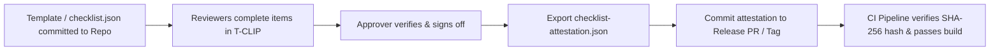

# T-CLIP — The Checklist Project

<div align="center">

**Traceable Compliance & Integration for Pre-release**  
*A local-first, schema-driven checklist engine for security reviews, compliance audits, change management, and release sign-offs.*

[](LICENSE)
[](https://react.dev/)
[](https://www.typescriptlang.org/)
[](https://vitejs.dev/)
[](https://vitest.dev/)
[](#architectural-pillars)
[](#zero-telemetry--privacy)
[](HELP.md)

[**User & Operating Guide**](HELP.md) • [Features](#features) • [Capability Model](#capability--role-model) • [File Specs](#file-format-reference)

</div>

---

## Overview

**T-CLIP** (The Checklist Project) is an open-source, client-side compliance governance tool. It enables software teams, security leads, compliance officers, and release managers to evaluate, manage, and attest release readiness against rigorous security and compliance frameworks.

Traditional compliance reviews are plagued by brittle spreadsheets, unverified wiki pages, or bloated SaaS platforms that introduce security risks. **T-CLIP** solves this with a portable, schema-driven, single-file architecture (`checklist.json`) paired with cryptographic SHA-256 attestations, fine-grained role governance, and a rich, responsive interface—**running entirely in your web browser with zero backend requirements**.

---

## Architectural Pillars

- **100% Local-First & Zero Telemetry**  
  All parsing, evaluations, validations, and hashes occur client-side via the Web Crypto API. Your compliance data, vulnerability details, and review evidence never leave your browser session. Works offline, via static web servers, or from local `file://` distribution.
- **Schema-Driven Declarative Specs**  
  Every checklist is represented by a single, portable, human-readable `checklist.json` document. Controls, dynamic evidence schemas, required fields, and access rules are declared cleanly in JSON.
- **Role-Based Capability Model**  
  Enforces separation of duties across 5 progressive capability tiers (`observer`, `contributor`, `reviewer`, `approver`, `editor`). Roles are dynamically resolved at runtime from free-form role strings using customizable pattern matching.
- **Cryptographic Attestations (SHA-256)**  
  T-CLIP computes a SHA-256 hash of the loaded source file. When all mandatory items are resolved, it generates an immutable, tamper-evident `checklist-attestation.json` audit report binding the source hash to actor identities, responses, timestamps, and approver sign-offs.
- **Auto-Save & Resilient Session Recovery**  
  In-flight responses are auto-saved to browser `localStorage` keyed by the source file hash. If a page is accidentally refreshed or closed, work is safely restored upon reopening.

---

## Included Standards & Templates

T-CLIP ships with production-ready templates for premier industry security and AI standards:

| Template | Standard | Controls | Description |
|:---|:---|:---:|:---|
| **OWASP ASVS** | OWASP ASVS v4.0.3 | 286 items | Complete Application Security Verification Standard across all 14 chapters, L1–L3 levels, and CWE mappings. |
| **NIST AI RMF** | NIST AI RMF 1.0 | 72 subcategories | NIST Artificial Intelligence Risk Management Framework (SP 1270-1) covering GOVERN, MAP, MEASURE, and MANAGE. |
| **EU Cyber Resilience Act** | Regulation (EU) 2024/2847 | 50 requirements | Mandatory EU regulation covering all requirements across Annex I Part I (Product Properties), Annex I Part II (Vulnerability Handling), Annex II (User Instructions), Annex VII (Technical Dossier), and Chapter II (Manufacturer Obligations & Incident Reporting). |
| **OWASP Agentic AI** | OWASP Agentic AI Top 10 | 10 categories | Autonomous AI system risks including goal hijacking, tool misuse, privilege abuse, execution sandboxing, and multi-agent coordination. |
| **OWASP LLMSVS** | OWASP LLMSVS | Tiered | Technical Large Language Model Security Verification Standard covering prompt guardrails, RAG/vector stores, output sandboxing, and memory. |
| **OWASP LLM Top 10** | OWASP LLM Top 10 (2025) | Top 10 | Official GenAI vulnerability checklist covering prompt injection, sensitive data leakage, supply chain risks, and excessive agency. |
| **Custom / Import** | Custom Schema | Variable | Create custom checklists from scratch or import existing JSON schemas directly. |

---

## Features

### 1. Dual Checklist Views
- **Category Accordion View**: Grouped by operational categories with collapsible headers, category progress meters, and quick-filter tags.
- **Data Grid / Table View**: Dense, searchable, sortable multi-column grid powered by `@mui/x-data-grid` for rapid scanning and bulk review.
- **Instant Search & Quick Filters**: Filter by status (`Pass`, `Fail`, `N/A`, `Pending`), assigned items ("Assigned to me"), category multi-select, and mandatory-only items.

### 2. Dynamic Evidence & Response Schema
- Evaluates standard item statuses: `pass`, `fail`, `na`, `pending`.
- Supports dynamic custom fields declared in the template schema:
  - `text` / `textarea` (with configurable character limits)
  - `select` (enumerated dropdown options)
  - `url` (validated links to PRs, Jira tickets, CI artifacts)
  - `boolean` (toggle confirmations)
  - `date` (ISO date picker)
- **Conditional Requirements (`requiredWhen`)**: Fields can dynamically become mandatory based on status (e.g., requiring an evidence URL only when marking `fail` or `pass`).
- **Field-Level Permissions**: Control field visibility (`visibleTo`) and write access (`editableBy`) per capability tier.

### 3. Separation of Duties & Dual Sign-Off
- **Item History**: Every response records actor name, role, timestamp (ISO 8601 UTC), and field values.
- **Approver Confirmation**: Users with `approver` capability can formally confirm or override reviewer responses, establishing an immutable two-party review workflow.
- **Structural Governance**: Users with `editor` capability can add, edit, or delete items, modify categories, edit field schemas, and update project metadata in place.

### 4. Interactive Analytics Dashboard
- **Executive Summary Cards**: Real-time totals, completion rate percentage, pass/fail/na/pending distributions.
- **Visual Breakdown**: Interactive donut charts and category compliance meters.
- **Audit Queues**:
  - *Pending Responses*: Unanswered items grouped by category and assignee.
  - *Pending Approver Confirmation*: Completed items awaiting managerial sign-off.
  - *Action Item Leaderboard*: Ranks team members by outstanding action items.
- **Activity Sparkline**: Visual timeline of recent review velocity.

### 5. Tamper-Evident Attestation Export
- Blocks attestation export if any required checklist item is `pending` or missing required evidence.
- Pre-export read-only summary highlights all `fail` items and missing fields.
- Exports a standalone, portable `checklist-attestation.json` report containing the raw file's SHA-256 hash, full item responses, history, and timestamps for CI/CD gates and auditors.

---

## Capability & Role Model

T-CLIP uses an ascending 5-tier capability hierarchy:

```
observer  →  contributor  →  reviewer  →  approver  →  editor
 (Read)      (Add Data)     (Decide)    (Sign Off)   (Structure)
```

| Capability | Permissions | Typical Roles |
|:---|:---|:---|
| **`observer`** | Read-only inspection of checklist, evidence fields, history, and dashboard. | Auditor, Stakeholder, Guest |
| **`contributor`** | Can provide evidence, answers, and URLs into custom fields; cannot transition overall item status (`pass`/`fail`). | Developer, Engineer, Author |
| **`reviewer`** | Can evaluate items, change statuses (`pass`/`fail`/`na`), and submit review decisions with evidence. | Security Lead, QA Engineer, Reviewer |
| **`approver`** | All reviewer permissions + can verify, confirm, or override reviewer decisions for release sign-off. | Release Manager, VP Eng, Sign-off Authority |
| **`editor`** | Full permissions + structural editing (add/edit/delete items, categories, field schemas, project metadata, assignments). | Project Owner, Admin, Tech Lead |

> **Role Pattern Matching:** Role names are entered as free-text (e.g., `"Senior Security Reviewer"`). T-CLIP automatically matches roles against customizable rules in the **Settings Panel** (e.g., matching `"lead"` to `reviewer`, `"owner"` to `editor`).

---

## File Format Reference

### `checklist.json` Structure

```json
{
  "version": "1.0",
  "project": "PaymentGateway-Service",
  "branch": "release/v2.4",
  "rules": {
    "structureEditableBy": "editor",
    "enforcedAssignment": false
  },
  "roles": ["Security Reviewer", "Lead Developer", "Release Approver"],
  "fields": [
    {
      "id": "evidence_url",
      "label": "Evidence Link / PR",
      "type": "url",
      "requiredWhen": ["pass", "fail"],
      "editableBy": "contributor",
      "visibleTo": "observer"
    },
    {
      "id": "notes",
      "label": "Review Notes",
      "type": "textarea",
      "requiredWhen": ["fail"],
      "maxLength": 1000
    }
  ],
  "items": [
    {
      "id": "SEC-01",
      "category": "Authentication",
      "description": "Multi-Factor Authentication enforced on administrative endpoints",
      "status": "pending",
      "required": true,
      "assignedTo": {
        "role": "Security Reviewer"
      },
      "statusEditableBy": "reviewer"
    }
  ]
}
```

### `checklist-attestation.json` Format

```json
{
  "schemaVersion": "1.0",
  "project": "PaymentGateway-Service",
  "branch": "release/v2.4",
  "checklistVersion": "1.0",
  "sourceFileHash": "e3b0c44298fc1c149afbf4c8996fb92427ae41e4649b934ca495991b7852b855",
  "exportedAt": "2026-10-02T12:00:00.000Z",
  "items": [
    {
      "id": "SEC-01",
      "category": "Authentication",
      "description": "Multi-Factor Authentication enforced on administrative endpoints",
      "status": "pass",
      "required": true,
      "history": [
        {
          "actorName": "Alex Chen",
          "role": "Security Reviewer",
          "status": "pass",
          "fieldValues": {
            "evidence_url": "https://github.com/org/repo/pull/142"
          },
          "timestamp": "2026-10-02T11:45:00.000Z"
        }
      ],
      "confirmedBy": {
        "actorName": "Sarah Connor",
        "role": "Release Approver",
        "status": "pass",
        "fieldValues": {},
        "timestamp": "2026-10-02T11:50:00.000Z"
      }
    }
  ]
}
```

---

## Quickstart & Development

### Prerequisites

- **Node.js** 18.x or later
- **npm** 9.x or later

### Installation

```bash
# Clone the repository
git clone https://github.com/prashsiv-eng/T-CLIP.git
cd T-CLIP

# Install dependencies
npm install
```

### Running Locally

```bash
# Start the Vite development server with HMR
npm run dev
```

Visit `http://localhost:5173` in your browser.

### Running Tests

```bash
# Run Vitest test suite
npm test

# Run tests with Vitest UI
npm run test:ui
```

### Building for Production

```bash
# Typecheck and build optimized static assets
npm run build

# Preview production build locally
npm run preview
```

### Code Quality & Linting

```bash
# Run oxlint across the project
npm run lint
```

---

## Recommended CI/CD & GitOps Workflow

Because T-CLIP is 100% file-based and deterministic, it integrates smoothly into Git workflows:



1. **Commit Checklist**: Add `checklist.json` (e.g., standard OWASP ASVS or custom release criteria) to your project repository.
2. **Review & Sign-Off**: Reviewers and Approvers open the file in T-CLIP (or an internal static deployment), provide evidence, and record sign-offs.
3. **Export Attestation**: Once all mandatory items are resolved, export `checklist-attestation.json`.
4. **CI Verification**: In your release pipeline, verify that `sourceFileHash` matches the repository's `checklist.json` SHA-256 hash and that all mandatory items have `pass` status.

---

## Repository Structure

```
t-clip/
├── src/
│   ├── components/
│   │   ├── attestation/       # Read-only attestation summary & JSON exporter
│   │   ├── checklist/         # Accordion, data grid table, drawer response editor
│   │   ├── dashboard/         # Visual charts, metrics cards, leaderboards, queues
│   │   ├── editor/            # In-place item and metadata structural editors
│   │   ├── home/              # Hero screen, template chooser, persona selector
│   │   ├── layout/            # Sticky header, navigation tabs
│   │   ├── review/            # Session restore alert banner
│   │   ├── settings/          # Capability mapping & session management drawer
│   │   └── shared/            # Shared form controls & persona components
│   ├── hooks/                 # Custom React hooks (useChecklist, useDashboard, useSettings)
│   ├── schema/                # Schema validator (validateChecklistFile)
│   ├── templates/             # Embedded industry standard JSON templates
│   ├── test/                  # Vitest test specs & test fixtures
│   ├── types/                 # TypeScript interfaces and domain models
│   ├── utils/                 # Capability resolution, hashing, dashboard stats, export
│   ├── App.tsx                # Top-level state machine & phase router
│   ├── main.tsx               # Application root mount
│   └── theme.ts               # Material-UI dark mode design system
├── public/                    # Static assets
├── package.json               # Package definitions and scripts
├── tsconfig.json              # TypeScript configuration
└── vite.config.ts             # Vite build pipeline
```

---

## License

This project is licensed under the [MIT License](LICENSE).
